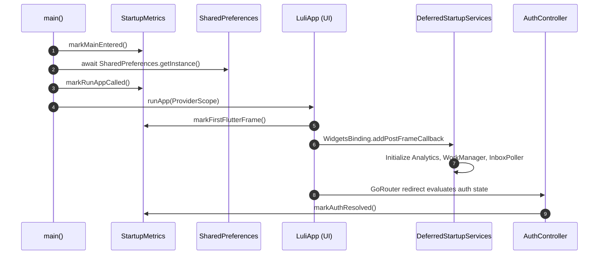

# Lily for Reddit — Deep Project Architecture & System Analysis

## 1. Executive Summary & Repository Overview

**Lily for Reddit** is a modern, high-performance Reddit client for Android (with an experimental iOS build target) designed around Google's **Material 3 Expressive (M3E)** design system. It is built primarily using **Flutter (Dart)** with Riverpod for state management, Dio for networking, and GoRouter for declarative routing.

A unique discovery in this repository is the presence of **two distinct application implementations**:
1. **The Primary Production App (Flutter)**: Located in `lib/`, with Android native runner in `android/`, iOS runner in `ios/`, and full automated test suites in `test/`. This is the application actively built, tested, and released via GitHub Actions (`.github/workflows/debug-apk.yml` and `release-apk.yml`).
2. **The Secondary Prototype Module (Android Jetpack Compose)**: Located in `app/`, configured via root `build.gradle.kts` and root `settings.gradle.kts`. This Kotlin/Jetpack Compose prototype was introduced in commit `9300786` (`feat/m3e-post-detail-refactor`). Subsequent development and all phase branches (Phases 1 through 5) have occurred exclusively in the Flutter codebase.

---

## 2. Technology Stack & Key Dependencies

### 2.1 Primary Flutter Stack
| Layer | Technologies / Libraries | Purpose & Configuration |
|---|---|---|
| **Language & SDK** | Dart 3.9+, Flutter SDK 3.35+ | Modern language features (patterns, records, sealed classes) |
| **State Management** | `flutter_riverpod: ^2.6.1`, `riverpod_annotation: ^2.6.1` | Compile-safe dependency injection, async caching, family notifiers |
| **HTTP & Networking** | `dio: ^5.7.0` | Authenticated client, bearer injection, token refresh, rate limiting, disk cache |
| **Serialization** | `freezed_annotation: ^2.4.4`, `json_annotation: ^4.9.0` | Immutable domain models with copyWith, unions, and JSON parsing |
| **Authentication** | `flutter_web_auth_2: ^5.0.3`, `flutter_secure_storage: ^9.2.2` | System-browser OAuth2 loopback, Android KeyStore / iOS Keychain token storage |
| **Navigation** | `go_router: ^14.6.2` | Declarative URL-based navigation, deep link redirection, auth route guards |
| **UI & Styling** | `dynamic_color: ^1.7.0`, Material 3 Expressive | Dynamic Material You palette extraction, custom AMOLED tokens |
| **Rich Content & Markdown** | `flutter_markdown: ^0.7.4+3`, `markdown: ^7.3.1` | Custom spoiler parser, comment markdown with non-selectable interactive spoilers |
| **Media Handling** | `cached_network_image`, `photo_view`, `video_player`, `chewie` | Intrinsic aspect ratio sizing, HLS video streams, zoomable photo galleries |
| **Background Services** | `workmanager: ^0.9.0+3`, `flutter_local_notifications: ^18.0.1` | Background inbox polling (zero Firebase/GMS dependency, F-Droid safe) |
| **Web Fallback** | `flutter_inappwebview: ^6.1.5` | In-app web session cookie capture ("Hydra" contingency fallback) |

### 2.2 Android Native Host (`android/`)
- **Gradle & AGP**: Gradle 8.12, Android Gradle Plugin (AGP) 8.11.1.
- **Java / Desugaring**: Java 11 / Java 17 target compatibility, `coreLibraryDesugaring("com.android.tools:desugar_jdk_libs:2.1.4")` for `java.time` APIs utilized by background notification services.
- **Release Optimization**: R8 code shrinking (`isMinifyEnabled = true`) and resource shrinking (`isShrinkResources = true`) with custom keep rules documented in `docs/android-release-optimization.md`.

### 2.3 Secondary Android Jetpack Compose Prototype (`app/`)
- **Stack**: Kotlin 2.0+, Jetpack Compose (BOM), Material 3, Navigation Compose, OkHttp, Coil 3, Room (SQLite) with KSP.
- **Role**: Experimental architecture sandbox exploring native Android M3E implementation.

---

## 3. Project Directory Structure

```
Lily-for-reddit/
├── .github/workflows/          # CI/CD pipelines (debug-apk.yml, release-apk.yml)
├── android/                    # Native Android wrapper for the Flutter engine
│   ├── app/                    # Flutter Android application runner
│   │   ├── build.gradle.kts    # AGP config, R8 shrinking, signing configs
│   │   └── src/main/           # AndroidManifest.xml, icons, splash assets
│   ├── build.gradle.kts        # Root build configuration for Flutter Android
│   └── settings.gradle.kts     # Flutter plugin loader & Android settings
├── app/                        # Standalone Kotlin Jetpack Compose prototype module
│   ├── build.gradle.kts        # Compose & Room build script
│   └── src/main/kotlin/        # Native Android MVVM implementation
├── assets/splash/              # App splash branding
├── docs/                       # Architectural & technical RFC documentation
│   ├── android-release-optimization.md  # R8 & ProGuard audit
│   ├── hydra-fallback.md                # Web session cookie auth contingency
│   └── startup-measurement.md           # Monotonic startup metrics & benchmarks
├── lib/                        # Core Flutter application source
│   ├── app.dart                # MaterialApp.router, lifecycle & deep-link observer
│   ├── main.dart               # Entry point & deferred services bootstrap
│   ├── router.dart             # GoRouter route definitions & auth guards
│   ├── core/                   # Shared architectural infrastructure
│   │   ├── analytics.dart      # Aptabase telemetry wrapper (opt-in)
│   │   ├── deep_links.dart     # Reddit URL regex parser
│   │   ├── deferred_startup.dart # Post-frame background service orchestrator
│   │   ├── media_aspect_ratio.dart # Intrinsic media geometry calculations
│   │   ├── providers.dart      # Global Riverpod service providers
│   │   ├── reddit_constants.dart # OAuth endpoints, scopes, User-Agents
│   │   ├── root_messenger.dart # Global ScaffoldMessengerState
│   │   ├── startup_metrics.dart# Monotonic launch latency instrumentation
│   │   ├── network/            # HTTP layer (RedditClient, ResponseCache, RateLimit)
│   │   ├── storage/            # InteractionVault, DeferredPrefWriter, SecureStore
│   │   ├── theme/              # M3E ColorSchemes, ShapeTokens, Typography, AppTheme
│   │   └── widgets/            # GlassSurface, M3ERefreshIndicator, M3ELoadingIndicator
│   ├── data/                   # RedditRepository (1000+ lines REST client facade)
│   ├── features/               # Feature-sliced modules
│   │   ├── auth/               # OAuth controller, repo, web & native login
│   │   ├── compose/            # Post creation screen
│   │   ├── explore/            # Subreddit discovery, multi-search, categories
│   │   ├── feed/               # PostCard, FeedController, FeedRanker, PostActionBar
│   │   ├── history/            # HistoryStore, InterestStore (on-device learning)
│   │   ├── home/               # HomeShell, lazy tab host, top bar modes
│   │   ├── inbox/              # Inbox messages, comment replies, thread screen
│   │   ├── media/              # Fullscreen gallery/video/image viewers, NSFW blur
│   │   ├── multireddit/        # Custom feeds management
│   │   ├── navigation/         # M3EFloatingNavBar (collapsing floating pill)
│   │   ├── notifications/      # Background poller & WorkManager registration
│   │   ├── post/               # PostDetailScreen, CommentCard, InteractiveSpoiler
│   │   ├── search/             # Global post, subreddit, and user search
│   │   ├── settings/           # Theme settings, personalization, data backup
│   │   └── subreddit/          # Subreddit banner, subscriber actions, flairs
│   └── models/                 # Freezed data models (Post, Comment, Subreddit, etc.)
├── test/                       # 23 Flutter unit and widget test suites
└── pubspec.yaml                # Flutter project manifest & dependencies
```

---

## 4. App Startup & Navigation Architecture

### 4.1 Cold Startup Pipeline
The cold start path is structured to minimize Time to Initial Display (TTID) and prevent jank:


1. **Phase A (Pre-`runApp`)**: Only `WidgetsFlutterBinding.ensureInitialized()` and `SharedPreferences.getInstance()` are awaited.
2. **Phase B (Root Frame)**: `LuliApp` mounts with `ProviderScope` overriding `sharedPrefsProvider`.
3. **Phase C (Deferred Initialization)**: `startDeferredStartupServices(prefs)` fires inside a post-frame callback, ensuring WorkManager, background polling, and telemetry never contend with the initial layout.
4. **Phase D (Stale-While-Refresh Auth & Badges)**: Auth state uses an account presence flag (`kHasAccountPref`). If platform KeyStore read delays occur, the app remains on the shell rather than bouncing to the login screen.

### 4.2 Declarative Routing & Tab Laziness
- **Router Configuration (`lib/router.dart`)**: GoRouter listens to `authControllerProvider`. It supports cold-start deep linking by translating incoming external Reddit URLs (`reddit.com/r/...`, `redd.it/...`) into internal routes (`/r/:name`, `/comments/:subreddit/:id`).
- **Lazy Tab Instantiation (`HomeShell`)**:
  - Home contains 4 tabs: Posts (`0`), Explore (`1`), Inbox (`2`), Account (`3`).
  - To prevent startup network contention, only **Posts** is built on launch. Explore, Inbox, and Account are initialized as `null` placeholders.
  - When selected, a tab is mounted in a `_LazyKeepAliveTabHost` utilizing `Offstage` and `TickerMode`. Scroll positions and Riverpod state are retained across tab switches while animations in inactive tabs are paused.

---

## 5. Authentication, Network & Token Architecture

### 5.1 Dual-Engine Authentication
1. **Bring-Your-Own-Key OAuth2 (Installed App Flow)**:
   - Configured via `RedditConstants`: `https://www.reddit.com/api/v1/authorize.compact`.
   - Uses `flutter_web_auth_2` to intercept `luli://oauth`.
   - Authorization code exchanged for `access_token` and `refresh_token`.
   - Stored securely in `FlutterSecureStorage` (encrypted keychain/KeyStore).
   - Supports seamless multi-account switching (`accountsProvider`).
2. **Hydra Website-Session Contingency (`docs/hydra-fallback.md`)**:
   - Built to handle Reddit's restrictions on user API key generation.
   - Embeds `InAppWebView` to capture browser session cookies (`reddit_session`).
   - Fetches `https://www.reddit.com/api/me.json` to retrieve the CSRF token (`modhash`).
   - Injects `cookie` and `X-Modhash` headers for web-mode transactions.

### 5.2 Network Layer & Resilience (`RedditClient`)
- **Transport**: Dio instance configured with custom User-Agent formatting (`<App>:<Version> (by /u/<Username>)`).
- **Single-Flight Token Refresh**: When a request returns `401 Unauthorized`, an interceptor intercepts the failure. Concurrent 401s are collapsed into a single `_refreshing` Future so refresh tokens are never double-spent.
- **Disk Response Cache (`ResponseCache`)**: GET responses can be cached to disk. If a network connection failure occurs (`DioExceptionType.connectionError`), the client seamlessly falls back to cached responses.
- **Rate Limit Tracking**: Monitors `x-ratelimit-*` headers and updates `rateLimitProvider` to avoid Reddit's 100 req/min API ceiling.

---

## 6. State Management, Persistence & Data Flow

### 6.1 State Management Overview
The application follows a structured layered reactive pattern using **Riverpod 2.x**:

```
UI Layer (Widgets / Presenters)
    ▲
    │ watches / listens
    ▼
Controllers / Notifiers (FeedController, CommentsController, PostOverrides, CommentOverrides)
    ▲
    │ reads / calls
    ▼
Repositories (RedditRepository, AuthRepository)
    ▲
    │ executes
    ▼
Data Sources (RedditClient, SecureStore, SharedPreferences, ResponseCache)
```

### 6.2 The Optimistic Mutation Pipeline
To eliminate interaction lag and keep the feed, subreddit, and post-detail views in sync without network roundtrips:
- **`PostOverridesController`**: Stores a map of `PostOverride(likes, score, numComments, saved)` keyed by post ID.
- **`CommentOverridesController`**: Stores a map of `CommentOverride(likes, score, saved)` keyed by comment fullname (`t1_...`).
- When a user votes or saves:
  1. The controller immediately calculates the target delta and commits the change to local state.
  2. The UI renders the updated state instantly.
  3. The asynchronous network call is executed.
  4. If the network call throws an error, the controller automatically rolls back the state to the previous authoritative snapshot.

### 6.3 Deferred Persistence & Debouncing (Phase 5 Hygiene)
Stores that record rapid interaction events (`InteractionVault`, `HistoryStore`, `InterestStore`) previously serialized their entire data structures to `SharedPreferences` on every gesture.
- **`DeferredPrefWriter`**: Implements a 500ms debounce quiet-window. Rapid bursts of dwell logging or voting collapse into at most one disk write.
- Exposes `flush()` to guarantee durability on screen disposal and test teardown.

---

## 7. Feed Architecture & On-Device "For You" Engine

### 7.1 "For You" Candidate Generation & Scoring
Because third-party clients cannot access Reddit's proprietary recommendation server, Lily implements an **on-device recommendation engine** (`FeedRanker`):
1. **Candidate Pool**: Concurrently fetches posts from subscribed frontpage (`/best`), favourite communities, high-interest subreddits, rising posts, and discovery candidates (`r/popular`).
2. **Scoring Formula**:
   $$\text{DecayedScore} = \frac{\text{post.score} + 1.5 \times \text{numComments}}{(\text{ageInHours} + 2.0)^{1.6}}$$
3. **Multipliers**:
   - Saved: $\times 3.5$
   - Comment opened: $\times 2.5$
   - Upvoted: $\times 1.2$
   - Downvoted / Dismissed: $\times -10.0$ (suppression)
   - Affinity multiplier: Up to $\times 1.8$ based on local learned community weights.
4. **Diversity & De-duplication**:
   - Sliding window of 6 posts enforcing a maximum of 2 consecutive posts from the same subreddit.
   - Posts already seen or marked in `InteractionVault` are filtered or severely demoted.

### 7.2 Two-Stage For You Loading
- **Stage 1 (Preview)**: Loads a rapid 25-post slice from `/best` to ensure immediate content display.
- **Stage 2 (Background Enrichment)**: Executes full candidate discovery and ranking, staging results behind a "New posts" floating pill to prevent jarring scroll jumps.

---

## 8. Material 3 Expressive (M3E) Design System

Lily features a comprehensive M3E implementation:
- **Surface Hierarchy & AMOLED Mode**:
  - Root scaffold: True black (`#000000`).
  - Surface containers: Layered elevation steps (`#0A0A0C`, `#121215`, `#1A1A1F`, `#222228`, `#2C2C34`).
  - Comment cards utilize high-contrast `#16161C` containers against true black backgrounds.
- **Tonal Depth Rails**:
  - Nested comment replies feature a 3.5dp rounded rail cycling through `primary`, `secondary`, and `tertiary` container accents at 55% opacity.
- **Shape Tokens (`ShapeTokens`)**:
  - Full (999dp pill), ExtraLarge (28dp), Large (24dp), Medium (20dp), Small (16dp), ExtraSmall (12dp).
- **Floating Morphing Navigation Bar (`M3EFloatingNavBar`)**:
  - Floating pill elevated 12dp above screen edge.
  - Automatically collapses from 60dp to 44dp on scroll down, hiding labels and preserving vertical screen real estate.
- **Action Pills**:
  - Segmented vote capsules with distinct upvote (`#FF7E54`) and downvote (`#BFC0FF`) brand accents.
